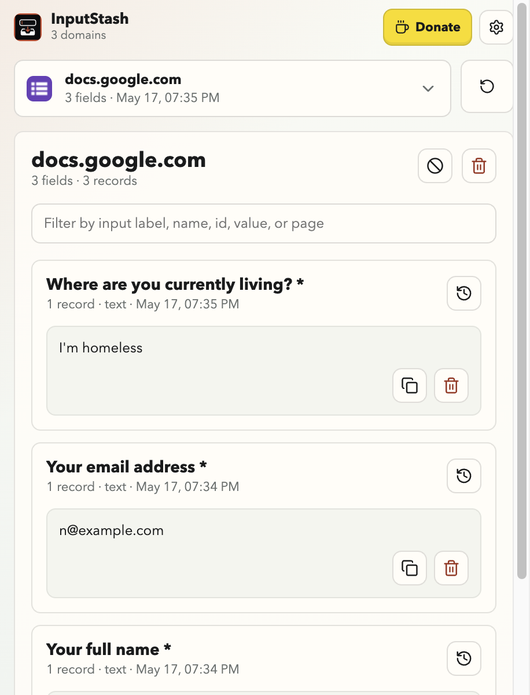

<p align="center">
  
</p>

# InputStash

Never lose what you typed.

A cross-browser extension that quietly remembers what you've typed into form fields, so an accidental `Esc`, a rogue keyboard shortcut, a refresh, or a tab close never destroys your draft again. Open the toolbar icon, find the input you lost, copy it back.

> Built and maintained by one indie developer. If it saves you a painful retype, [☕ buy me a coffee](https://buymeacoffee.com/mekedron) — it keeps InputStash free and ad-free.

<p align="center">
  
</p>

## What it does

- Captures every `<input>`, `<textarea>`, and `contenteditable` field across every site you visit, debounced per-field.
- Walks open shadow roots and re-attaches when new fields mount via `MutationObserver`, so SPAs and rich editors (Gmail, Notion, Slack, Google Docs) are covered.
- Runs in every frame, so iframes (including cross-origin ones) are captured independently.
- Groups captures by domain in the popup, with per-field history so you can grab an older revision of a single input.
- Skips password fields and inputs with sensitive autocomplete tokens (`current-password`, `new-password`, `one-time-code`, `cc-number`, …) before they ever hit storage.
- Per-domain and per-field opt-out, plus a "clear everything" button.
- Stores everything in `browser.storage.local`. No network, no analytics, no accounts.
- Light / dark / auto theme.

## Stack

- [WXT](https://wxt.dev) — one config builds Chrome, Edge, Opera, Brave, and Firefox from the same source. MV3 by default. Bundled `browser.*` polyfill.
- TypeScript
- Svelte 5 (popup UI)
- HMR in dev: saving the popup reloads instantly; content/background changes trigger an auto-reload of the extension.

## Requirements

- Node 22 LTS (a `.nvmrc` is included)
- pnpm 11 (`npm i -g pnpm`)

## Quickstart

```bash
pnpm install
pnpm dev            # launches Chrome with the extension auto-loaded
pnpm dev:firefox    # same, in Firefox Developer Edition
```

## Build

```bash
pnpm build              # → .output/chrome-mv3/
pnpm build:firefox      # → .output/firefox-mv2/
pnpm zip                # store-ready Chromium zip
pnpm zip:firefox        # store-ready Firefox zip
```

Tagged pushes (`v*`) trigger the release workflow in `.github/workflows/release.yml`, which builds both zips and attaches them to a GitHub Release.

## Loading the built extension

After `pnpm build`, the unpacked extension lives in `.output/chrome-mv3/` (or `.output/firefox-mv2/` after `pnpm build:firefox`).

### Chrome, Edge, Opera, Brave

All four use the same flow — they're all Chromium under the hood.

1. Open `chrome://extensions` (or `edge://extensions`, `opera://extensions`, `brave://extensions`).
2. Toggle **Developer mode** on (top-right).
3. Click **Load unpacked**.
4. Select `.output/chrome-mv3/`.

### Firefox

1. Open `about:debugging#/runtime/this-firefox`.
2. Click **Load Temporary Add-on…**.
3. Select `.output/firefox-mv2/manifest.json`.

(Temporary add-ons are removed when Firefox restarts. For permanent local install, you'd need to sign through AMO.)

### Safari

Deferred. Safari supports the WebExtension API but requires an Xcode wrapper for distribution. When ready, Apple's `safari-web-extension-converter` can wrap `.output/chrome-mv3/` directly:

```bash
xcrun safari-web-extension-converter .output/chrome-mv3/
```

You'll need Xcode and an Apple Developer account to ship; for local testing you can enable unsigned extensions under Safari → Settings → Advanced → Develop menu → Allow unsigned extensions.

## Typecheck

```bash
pnpm compile
```

Runs `svelte-check` followed by `tsc --noEmit`.

## Privacy

- Everything lives in `browser.storage.local`, scoped per origin.
- Password fields and inputs with sensitive `autocomplete` tokens are filtered out at the capture layer.
- Captures are capped per origin and deduped; near-identical consecutive snapshots are collapsed.
- Per-domain and per-field opt-out from the popup.
- No telemetry, no network requests, no accounts.

## What's still ahead

- Listings on the Chrome Web Store, Firefox Add-ons, and Edge Add-ons (in review).
- Safari packaging via `safari-web-extension-converter`.
- Optional encrypted export / import.

## Support the project

InputStash is a solo indie effort — no company, no investors, no ads, no analytics. Every snapshot stays on your device.

If it earned its place in your toolbar, the easiest way to help is to chip in a coffee:

**[☕ buymeacoffee.com/mekedron](https://buymeacoffee.com/mekedron)**

Other ways to help that cost nothing:

- Star this repo so more people find it.
- File a bug or feature request in [Issues](../../issues).
- Tell a friend who keeps losing half-written emails.

## License

[MIT](LICENSE) © Nikita R
